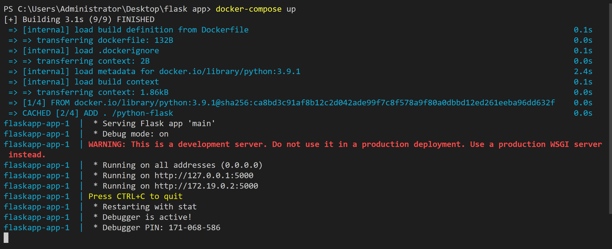

# Lancer une application flask avec Docker compose


> Cela est un descriptif des étapes qu'on a élaboré pour déployer l'application.

---

### Table des matières: 


- [Description](#description)
- [Comment utiliser](#Comment-utiliser)
- [References](#references)
- [Contributeurs](#Contributeurs)

---

## Description

L'objectif de notre projet est de créer une application Web Python simple exécutée sur Docker-Compose. L’application utilise le framework Flask.

### Technologies

- Docker 
- Flask 

[Back To The Top](#read-me-template)

---

## Comment utiliser :


### Étape 1: Configuration

Définissez les dépendances de l’application.


1. Créez un répertoire pour le projet:


```py
$ mkdir flaskapp
$ cd flaskapp
```
2. Créez un fichier appelé main.py dans le répertoire de notre projet avec ce code:

```py
from flask import Flask
app = Flask(__name__)

@app.route('/')
def hello_world():
	return 'Hello World'

if __name__ == '__main__':
	app.run(host="0.0.0.0", debug=True)
```
3. Créez un autre fichier appelé requirements.txt dans le répertoire: 

```py
Flask
```
### Étape 2: Créez un Dockerfile:

Dans cette étape, nous créons un Dockerfile qui crée une image Docker. L’image contient toutes les dépendances requises par l’application Python, y compris Python lui-même.

```py
FROM python:3.9.1
ADD . /python-flask
WORKDIR /python-flask
RUN pip install -r requirements.txt
```

### Étape 3: définir les services dans un fichier docker-compose

Créer un fichier appelé docker-compose.yml dans le répertoire de notre projet:

```py
version: "3.8"
services:
  app:
    build: .
    command: python main.py
    ports:
      - "5000:5000"
    volumes:
      - .:/python-flask
```

L'app utilise une image crée à partir de Dockerfile dans le répertoire actuel. Il se lie alors le conteneur et la machine hôte au port exposé, 5000. Ce service utilise le port 5000 par défaut pour le serveur Web Flask.


### Étape 4: Créer et exécuter l'application avec Docker-Compose :

Depuis le répertoire de projet, et sur le terminal et démarre l'application en exécutant:

```py
$ docker-compose up
```

et voilà l'application web flask lancé avec Docker:




Entrez http://localhost: 5000 / dans un navigateur pour voir l’application en cours d’exécution.

[Back To The Top](#read-me-template)

---

## References

https://docs.docker.com/develop/ 

https://docs.docker.com/engine/reference/builder/

https://flask.palletsprojects.com/en/2.2.x/


[Back To The Top](#read-me-template)

---

## Contributeurs :

- Github - [@Chair Hamza](https://github.com/A-HABACHE)
- Github - [@Abdesamad Habache](https://github.com/A-HABACHE)
- Github - [@Ahmed bettiouit](https://github.com/abettiouit)

[Back To The Top](#read-me-template)    
